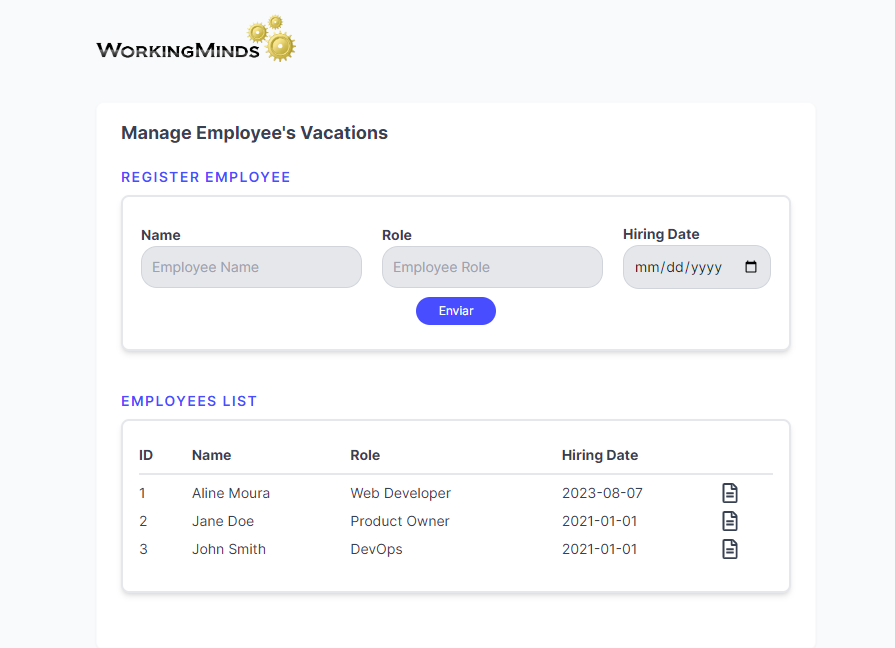
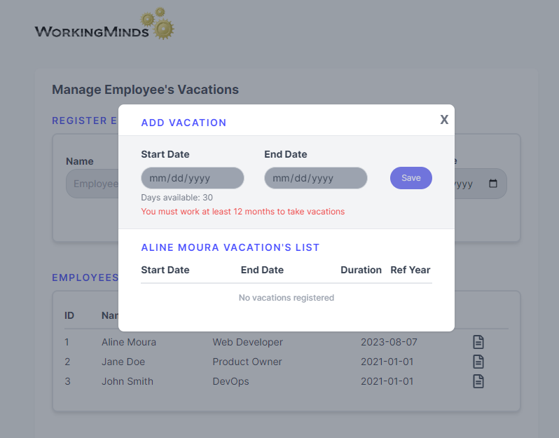
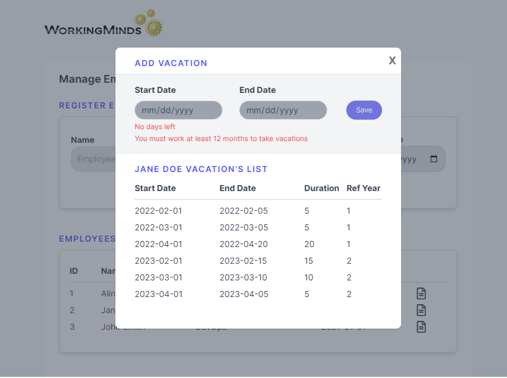
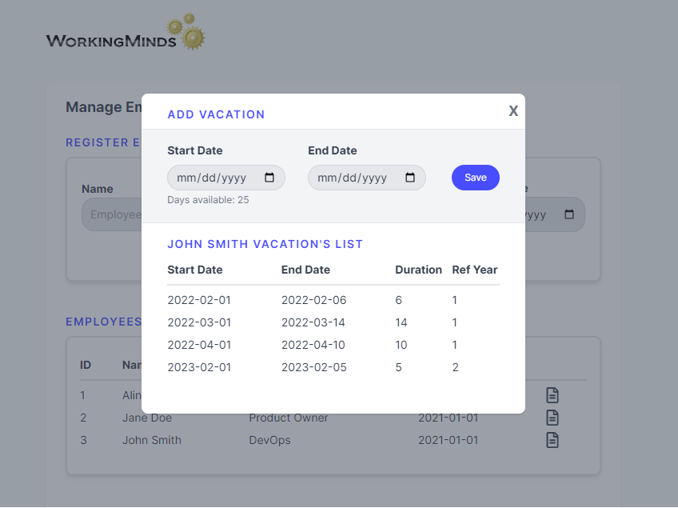

## Employee's Vacations Manager App

Employee's Vacations Manager App is an intuitive tool to streamline solution for managing company employee vacations. This application offers a comprehensive view of each employee's details and their vacation history, offering for the user a more efficient vacation planning.

### Features

1. For employees:
   - Add new employee with fields for name, role, and hiring date.
   - See a consolidated list of all employees registered in the system.
   - Each employee has a clickable icon leading to a modal with vacations detailed.
2. For vacations: - Add a vacation period to an employee with fields for start date and end date. - See a consolided list of all vacations taken by the selected employee with: - Start and end dates - Duration - Reference year: reference of the number of complete years an employee has been with the company when they took that specific vacation. It offers a clear timeline to differentiate between vacations taken in different years of employment.
<div>




</div>

### Business Roles

The application was designed to follow the business rules below:

1. it's necessary to be able to register employees with the following details:
   Name, Role, Hiring Date and Vacation Periods.
2. To register a vacation is necessary to, provide the start date and end date of the vacation period, following the rules below:
   - It's possible to register one or more periods for each employee
   - Each employee earns 30 days of vacation for every 12-month period.
   - The first vacation period can only be scheduled to start at least 12 months after the hiring date.
   - Not allow the registration of overlapping vacation periods for the same employee.
   - Vacations can be split into up to three periods,
   - One of them must not be less than 14 consecutive days
   - Minimum vacation period for the others are not less than 5 consecutive days

### Premises and Assumptions

For a more streamlined user experience in the application, certain assumptions were made to guide the development and establish logical conditions:

1. Vacation days from one year do not roll over to the next.
   - It's assumed that employees utilize all of their earned vacation days within the year they were accrued.
   - Thus, for every 12 months worked, the employee takes the full 30 days of vacation in the subsequent year.
2. The duration of the vacation period is calculated based on start date and end date with the following formula:
   - duration = end_date - start_date + 1
3. Vacations can only be registered within a 12-month window from the last employment anniversary. For instance:
   - Hiring date: 01/01/2020
   - First vacation duration (assuming the entire 30 days are used in this period): 01/01/2021 to 12/01/2021
   - Second vacation duration (assuming the entire 30 days are used in this period): 01/01/2022 to 01/12/2022
   - The time frame for logging a new vacation: 01/01/2023 to 01/12/2023

### Technical Tools

The application was developed using Next.js, a React framework for production.

- TypeScript: to ensure type safety and enhance code quality and maintainability.
- Tailwind CSS: a utility-first CSS framework for rapidly building custom user interfaces.
- Next.js API routes: The backend structure of the application is solidified by the built-in API system of Next.js, facilitating seamless request handling.
- MySQL: relational database choosen to ensure efficient, secure, and scalable data management.

### Database Model

The database model was designed to follow the business rules below:

- The database has two tables: employees and vacations.
  - The employees table has the following fields: id, name, role, hiring_date.
  - The vacations table has the following fields: id, employee_id, start_date, end_date,duration, ref_year.

```bash
# SQL script to create the database and tables

CREATE TABLE employees (
	id INT PRIMARY KEY AUTO_INCREMENT,
	name VARCHAR(100) NOT NULL,
	role VARCHAR(100) NOT NULL,
	hiring_date DATE NOT NULL DEFAULT (CURRENT_DATE)
);

CREATE TABLE vacations (
  id INT PRIMARY KEY AUTO_INCREMENT,
  employee_id INT NOT NULL,
  start_date DATE NOT NULL,
  end_date DATE NOT NULL,
  duration INT NOT NULL,
  ref_year INT NOT NULL,
  FOREIGN KEY (employee_id) REFERENCES employees(id)
);
```

### API Routes

The application has two API routes:

1. /api/employees: responsible for the GET and POST operations of the employees table.
2. /api/vacations/[id]: responsible for GET the list of vacations by employee_id.
3. /api/vacations: responsible for the POST a vacation into vacations table.

### Future Improvements

1. Allow the user to edit the employee's information.
2. Allow the user to edit the employee's vacation periods.
3. Allow the user to delete the employee's vacation periods.
4. Allow the user to delete the employee's information.
5. Add unit tests and integration tests to the application.
6. Add a login system to the application.

## How to run the application

First, run the development server:

```bash
npm install
npm run dev
```

##
